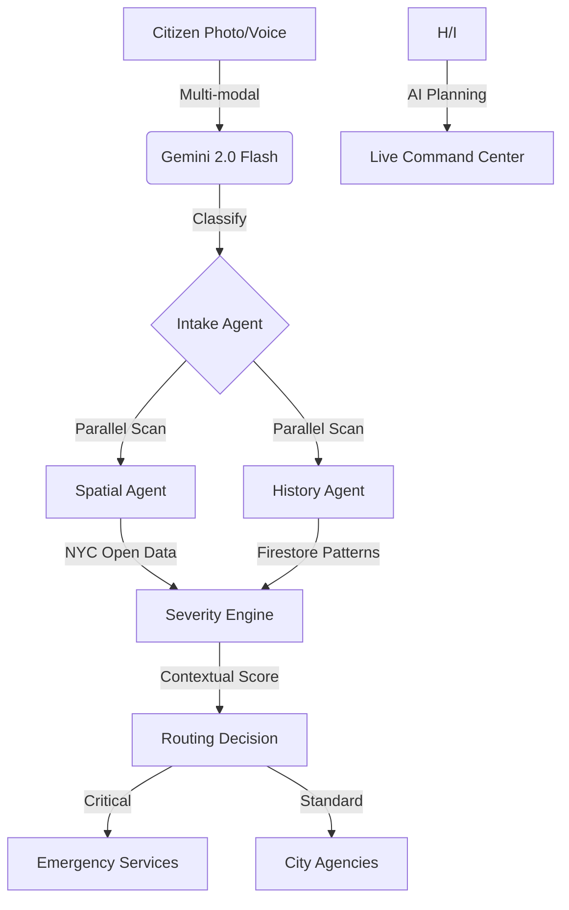

<div align="center">

# 🏙️ Smart311 AI: Urban Command Center
**An Enterprise-Grade Civic Response System powered by Google Cloud & Gemini 2.0 Flash**

[](https://smart311-frontend-446616000971.us-east1.run.app/dashboard)
[](#cloud-native-stack)

**Smart311 AI** transforms chaotic city reporting into a surgical, high-tech dispatch pipeline. Built for the *Build With AI NYC Hackathon*, it uses multi-modal Gemini to "see" and "hear" emergencies, triaging them against real NYC Open Data infrastructure maps in milliseconds.

</div>

---

## 🚀 Live Cloud Endpoints

| Component | Cloud Run URL |
|-----------|---------------|
| **Tactical Command Center** | [Dashboard Interface](https://smart311-frontend-446616000971.us-east1.run.app/dashboard) |
| **Citizen Vision App** | [Reporting Portal](https://smart311-frontend-446616000971.us-east1.run.app) |
| **Intelligent API** | [Backend Service](https://smart311-backend-446616000971.us-east1.run.app) |

---

## 🧠 The AI Pipeline: "Vision to Dispatch"



---

## ☁️ Cloud-Native Stack (GCP Implementation)

We transitioned from a local prototype to a production-ready GCP architecture:

*   **Brain**: **Vertex AI (Gemini 2.0 Flash)** handles all multi-modal intake, classifying issues from raw photos and voice transcripts.
*   **Memory**: **Cloud Firestore** provides a persistent, real-time database for city incidents, ensuring data survives server restarts.
*   **Vault**: **Google Cloud Storage (GCS)** stores visual evidence permanently, giving dispatchers instant access to high-res reports.
*   **Auditor**: **Cloud Logging** creates an immutable audit trail of every AI decision for government accountability.
*   **Compute**: **Cloud Run** hosts our containerized Next.js and FastAPI services with global auto-scaling.

---

## 📸 Screenshots

### Citizen Emergency Response Portal


### AI Draft Review — Severity Score & Cluster Warning


### Tactical Command Center — Live Priority Queue & Map


### Report Detail — Triage Factors & Dispatch


### Agent Intelligence Feed — Live AI Dispatch Steps


---

## ✨ Key Features

### 1. Neural Vision Triage
Don't just describe the problem—show it. Our **Multi-modal Vision Ingestion** uses Gemini to automatically detect "Gas Leaks" or "Water Main Breaks" directly from a photo, calculating severity based on visual cues.

### 2. Tactical Spatial Awareness
The system doesn't just know *what* happened; it knows *where* it is. It automatically cross-references reports against:
*   **Critical Infrastructure**: Proximity to Hospitals, Schools, and Subway Entrances.
*   **NYC DCP Facilities**: Real-time access to city infrastructure maps.
*   **Cluster Detection**: Automatic escalation if 3+ reports appear in the same grid.

### 3. Agent Intelligence Feed
A live, scrollable audit trail of AI agent activity. Watch the **Intake Agent**, **Spatial Agent**, and **Severity Engine** work in parallel to process reports in real-time.

---

## 🛠️ Getting Started

### Local Setup
```bash
# 1. Clone & Setup Backend
cd backend
python -m venv .venv && source .venv/bin/activate
pip install -r requirements.txt
python main.py

# 2. Setup Frontend
cd frontend
npm install
npm run dev
```

### Environment Config (`.env`)
```bash
GOOGLE_CLOUD_PROJECT=your-project-id
GCP_BUCKET_NAME=smart311-images
GEMINI_API_KEY=your-api-key
```

---

## 🏅 The Hackathon Demo Guide

1.  **The Signal**: Open the **Citizen App**, upload a photo of a "Cracked Pipe."
2.  **The Scan**: Show the **Neural Vision Scan** animation as Gemini analyzes the image.
3.  **The Command**: Switch to the **Dashboard**. Watch the report jump to the top of the **Priority Queue**.
4.  **The Proof**: Show the **Intelligence Feed**—where the AI explains *why* it scored the report a "95/100" (e.g., "Proximity to Hospital + Cluster detected").

---

## 👥 Team & Contributors

*   **Jkanishkha0305**
*   **JeethuSreeni**

---

<div align="center">
Built with ❤️ for NYC by the Build With AI Team.
</div>
